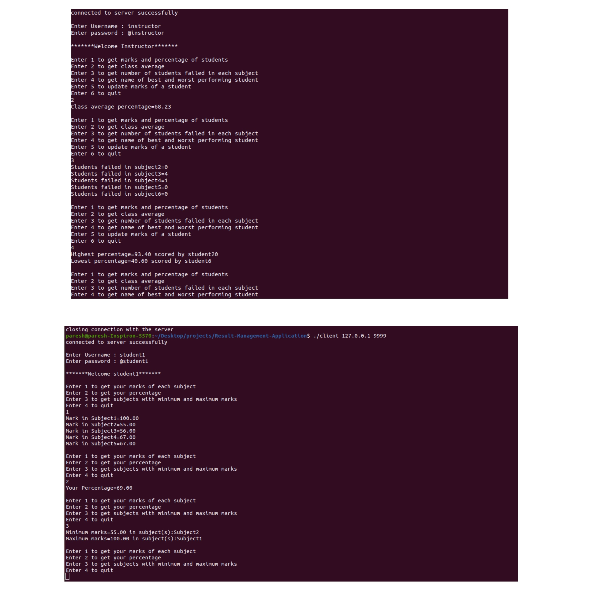

# Result-Management-Application

* A client-server program where clients (instructor or students) can access their information through their respective password . Instructors can view, delete, update scores and see top scores in each subject.
* Student marks are saved in student_marks.txt file.
* Instructor and student username and password are saved in user_pass.txt.

## Tags

C programming, Socket programming.

## Demo

To compile server.c and client.c

```
gcc server.c -o server
gcc client.c -o client
```

To start server, PORT number is to be given as argument(ex. 9999)

```
./server PORT_NUMBER
````

To execute the client process, the IP address and PORT number of server is to be passed as command line argument.
```
./client IP_ADDR_OF_SERVER PORT_NUMBER
```
## Username and Password

Default usernames and password mentioned in user_pass.txt.

* For instructor : Username - instructor, Password - @instructor
* For students   : Username - student1-student20, Password - @student1 - @student20

## Images


